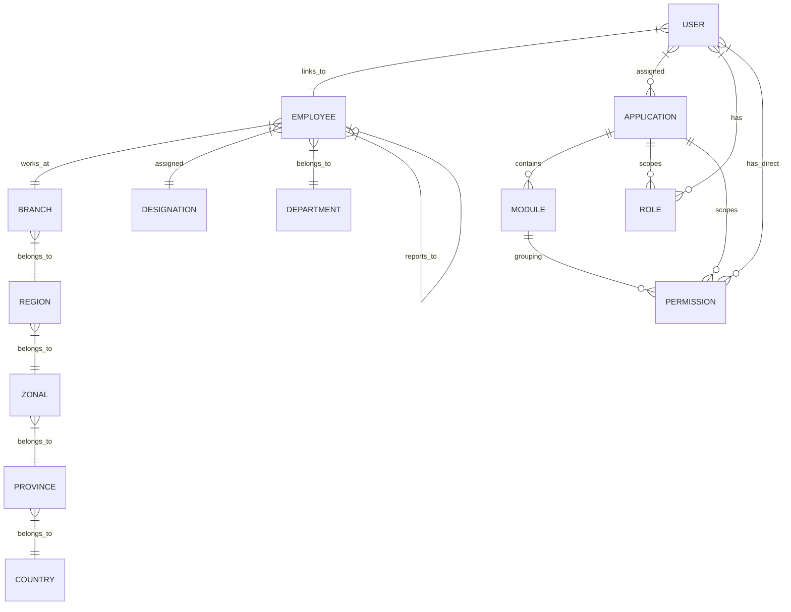

# CDP GIAM API

> **Global Identity and Access Management System**

High-performance Global Identity and Access Management (GIAM) API built on Laravel 12. Provides multi-application RBAC (Spatie), JWT auth, and hierarchical organizational structure (countries, provinces, regions, zones, branches, departments, designations, and employees with manager reporting).

---

## Table of Contents

- [Architectural Overview](#architectural-overview)
- [Key Features](#key-features)
- [System Architecture & Data Model](#system-architecture--data-model)
- [Directory Structure](#directory-structure)
- [API Endpoints Reference](#api-endpoints-reference)
  - [Authentication](#authentication)
  - [Role & Permission Management](#role--permission-management)
  - [User & Employee Management](#user--employee-management)
  - [Application & Module Registrations](#application--module-registrations)
  - [Geographical & Hierarchy Master Data](#geographical--hierarchy-master-data)
  - [Departments, Designations & Groups](#departments-designations--groups)
- [Security & Core Components](#security--core-components)
  - [Activity Logging](#activity-logging)
  - [JWT Token-Based Authentication](#jwt-token-based-authentication)
- [Installation & Local Setup](#installation--local-setup)
- [Testing & Coding Standards](#testing--coding-standards)

---

## Architectural Overview

The **CDP GIAM API** serves as the central directory and security enforcement authority for multiple consumer applications (e.g., `cdp-connect-api`). Instead of duplicating users, roles, and profiles across different tools, this GIAM platform hosts a unified database of employees, geographical hierarchies, and user access parameters.

Key highlights of the architecture include:
1. **Multi-Application Isolation:** Roles and permissions are scoped by an `application_id`. A single user can hold one set of roles/permissions on "App A" and an entirely different set on "App B".
2. **Organizational Hierarchy Mapping:** Models a complete corporate matrix from countries down to provinces, zones, regions, branches, departments, designations, and individual employee files.
3. **Manager Reporting Tree:** Supports lineage querying (e.g., retrieving all direct and indirect subordinates under a specific manager in the organization).

---

## Key Features

- **JWT Authentication:** Secure token issuance using `php-open-source-saver/jwt-auth` with automatic cookie and header support.
- **Dynamic Scoped Permissions:** Custom extensions built over Spatie's permission system to isolate roles/permissions by `application_id` and `module_id`.
- **Dual User Types:**
  - `admin`: Core system administrator profiles (restricted management capabilities).
  - `staff`: Linked to detailed Employee profiles, with credentials defaulting to national/company identifiers.
- **Reporting Lineage:** Built-in recursive fetching of organizational descendants (direct and indirect reports).
- **Comprehensive Audit Trail:** Automated activity logging using an event-safe logging trait (`ActivityLogTrait`), complete with dynamic parameter redaction for sensitive keys (e.g. `password`, `token`).
- **Flexible Toggle States:** Standardized status toggle endpoints across all master datasets for soft-deactivation.

---

## System Architecture & Data Model

The GIAM database is organized around the following entity relationships:



### Table Definitions & Scoping Changes
- `applications`: Defines consumer apps (e.g., Connect, Portal, Admin) containing `name`, `code`, `is_active`, `app_url`.
- `modules`: Groups features within applications.
- `roles` / `permissions`: Altered Spatie tables containing `application_id` and `module_id` with multi-column unique constraints (`name`, `guard_name`, `application_id`).
- `employees`: Stores operational metadata: `employee_code`, `id_number`, reporting structures, and location mapping.
- `users`: Core login accounts with attributes such as `username`, `email`, `user_type` (`admin` or `staff`), status flags (`is_active`, `can_login`), and audit fields.

---

## Directory Structure

Key components of the codebase:
```
cdp-giam-api/
├── app/
│   ├── Http/
│   │   ├── Controllers/V1/      # API Controllers handling V1 requests
│   │   └── Requests/            # Form Requests handling validation
│   ├── Models/                  # Eloquent Models (User, Employee, Branch, etc.)
│   └── Traits/                  # Reusable Traits (ActivityLogTrait, FileUploadTrait)
├── bootstrap/                   # Laravel Bootstrapping code
├── config/                      # Config files (jwt.php, permission.php, etc.)
├── database/
│   ├── migrations/              # Database Schema Definitions
│   └── seeders/                 # Database seeders for initial bootstrap
├── routes/
│   ├── api.php                  # Main entry point (health checks)
│   └── v1.php                   # Version 1 route groupings (protected/public)
└── tests/                       # Pest & PHPUnit tests
```

---

## API Endpoints Reference

All endpoints (except login) require a Bearer token in the `Authorization` header: `Authorization: Bearer <token>`.

### Authentication
| Method | Endpoint | Description | Middleware |
| :--- | :--- | :--- | :--- |
| `POST` | `/api/v1/login` | Authenticate credentials and return JWT token | Public |
| `POST` | `/api/v1/logout`| Terminate session and invalidate JWT token | `auth:api` |
| `GET` | `/api/v1/me` | Fetch authenticated user details, roles, and applications | `auth:api` |

### Role & Permission Management
| Method | Endpoint | Description | Middleware / Permission |
| :--- | :--- | :--- | :--- |
| `GET` | `/api/v1/permissions/list` | Fetch active permission list | `auth:api` |
| `GET` | `/api/v1/permissions` | Paginated permissions list | `permission:Permission Index` |
| `POST` | `/api/v1/permissions` | Create a new permission | `permission:Permission Create` |
| `PUT/PATCH` | `/api/v1/permissions/{id}` | Update permission details | `permission:Permission Update` |
| `DELETE` | `/api/v1/permissions/{id}` | Delete a permission | `permission:Permission Delete` |
| `GET` | `/api/v1/roles/list` | Fetch available roles | `auth:api` |
| `GET` | `/api/v1/roles` | Paginated roles list | `permission:Role Index` |
| `POST` | `/api/v1/roles` | Create a new role | `permission:Role Create` |
| `PUT/PATCH` | `/api/v1/roles/{id}` | Update role | `permission:Role Update` |
| `DELETE` | `/api/v1/roles/{id}` | Delete role | `permission:Role Delete` |

### User & Employee Management
| Method | Endpoint | Description | Middleware / Permission |
| :--- | :--- | :--- | :--- |
| `GET` | `/api/v1/users` | List users with search, role, branch, status filters | `permission:User Index` |
| `GET` | `/api/v1/users/{id}` | Fetch specific user with related employee, geo-data, and roles | `permission:User Index` |
| `POST` | `/api/v1/users` | Create user (creates Employee profile if `user_type=staff`) | `permission:User Create` |
| `PUT/PATCH` | `/api/v1/users/{id}` | Update user & employee details | `permission:User Update` |
| `PATCH` | `/api/v1/users/{id}/toggle-status` | Toggle user active status | `permission:User Toggle Status` |
| `DELETE` | `/api/v1/users/{id}` | Soft delete or purge user | `permission:User Delete` |

### Application & Module Registrations
| Method | Endpoint | Description | Middleware / Permission |
| :--- | :--- | :--- | :--- |
| `GET` | `/api/v1/applications/list` | Fetch active applications | `auth:api` |
| `GET` | `/api/v1/applications` | List applications | `permission:Application Index` |
| `POST` | `/api/v1/applications` | Register new application | `permission:Application Create` |
| `PATCH` | `/api/v1/applications/{id}/toggle-status` | Toggle active status | `permission:Application Toggle Status` |
| `GET` | `/api/v1/modules` | List application modules | `permission:Module Index` |
| `POST` | `/api/v1/modules` | Add new module | `permission:Module Create` |

### Geographical & Hierarchy Master Data
Each geographical entity (Countries, Provinces, Zonals, Regions, Branches) supports a standard REST API resource layout:
- `GET /api/v1/{resource}` - Paginated index list
- `GET /api/v1/{resource}/list` - Non-paginated simple active dropdown list
- `POST /api/v1/{resource}` - Create item
- `PUT/PATCH /api/v1/{resource}/{id}` - Update item
- `PATCH /api/v1/{resource}/{id}/toggle-status` - Toggle active state
- `DELETE /api/v1/{resource}/{id}` - Remove item

### Departments, Designations & Groups
- **Departments & Designations:** Resource routes to manage teams and titles.
  - `GET /api/v1/departments/{id}/designations`: Retrieve designations mapped under a specific department.
- **Groups:** Grouping of users for target operations.
  - `GET /api/v1/groups/list`: Get simple listing of active user groups.

---

## Security & Core Components

### Activity Logging
The codebase uses `App\Traits\ActivityLogTrait` to standardise audit trails. Logging is fully decoupled from the core response flow, meaning a failure in database writing (e.g. database locking or connection drop) will gracefully fall back to log files instead of throwing a server crash (500).

```php
use App\Traits\ActivityLogTrait;

class ExampleController extends Controller {
    use ActivityLogTrait;

    public function processAction(Request $request) {
        // ... Logic code ...
        
        $this->logActivity(
            action: 'CREATE',
            module: 'User',
            description: "Created user profile: {$user->username}",
            payload: $request->all(),
            level: 'info'
        );
    }
}
```

### JWT Token-Based Authentication
Token settings are configured in `config/jwt.php`.
- Access tokens are configured to be returned in JSON response bodies and as a fallback secure HTTP-Only cookie (`auth_token`) to safeguard SPA and client integration flows.

---

## Installation & Local Setup

Follow these steps to set up the API repository locally:

### 1. Prerequisites
- PHP >= 8.2
- Composer
- MySQL or PostgreSQL database
- Web server (Laragon, Nginx, or artisan serve)

### 2. Setup Files & Dependencies
```bash
# Clone the repository
git clone <git-repo-url> cdp-giam-api
cd cdp-giam-api

# Install Composer packages
composer install

# Create environment configuration
cp .env.example .env
```

### 3. Key Generation & Database Prep
1. Generate the standard application key:
   ```bash
   php artisan key:generate
   ```
2. Open your `.env` file and configure database credentials:
   ```env
   DB_CONNECTION=mysql
   DB_HOST=127.0.0.1
   DB_PORT=3306
   DB_DATABASE=cdp_giam_db
   DB_USERNAME=root
   DB_PASSWORD=
   ```
3. Generate the JWT key:
   ```bash
   php artisan jwt:secret
   ```
4. Run migrations and database seeders:
   ```bash
   php artisan migrate --seed
   ```

### 4. Running the Server
You can boot up the development server using:
```bash
php artisan serve
```
The API will be available at `http://127.0.0.1:8000`.

---

## Testing & Coding Standards

The project utilizes **Pest PHP** for testing and **Laravel Pint** for code formatting.

- **Run Tests:**
  ```bash
  composer test
  ```
- **Code Style Alignment:**
  ```bash
  ./vendor/bin/pint
  ```
